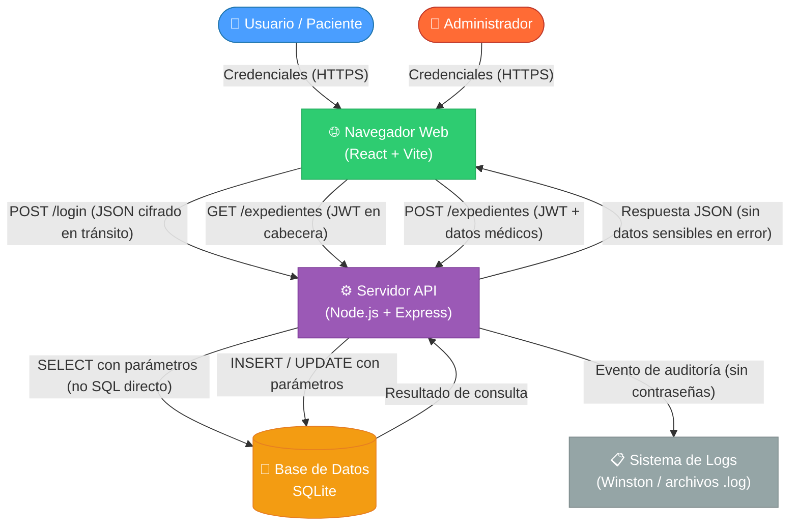

# Modelo de Amenazas: Sistema de Gestión de Expedientes Médicos

## 1. Diagrama de Flujo de Datos (DFD - Nivel 1)

El siguiente diagrama muestra cómo fluyen los datos entre los componentes del sistema y dónde existen puntos de riesgo.



---

## 2. DFD en Formato Texto (para quienes no renderizan Mermaid)

```
[Usuario/Admin]
      │
      │  (1) HTTPS: envía email + contraseña
      ▼
[Navegador - React]
      │
      │  (2) Valida formato en cliente (regex, longitud)
      │  (3) HTTPS POST /api/auth/login  {email, password}
      ▼
[Servidor Express] ◄──── (9) Escribe evento de auditoría ────► [Archivo .log]
      │
      │  (4) Rate Limiter verifica intentos
      │  (5) Zod valida esquema del body
      │  (6) Consulta parametrizada: SELECT WHERE email = ?
      ▼
[SQLite Database]
      │
      │  (7) Devuelve fila del usuario (password_hash)
      ▼
[Servidor Express]
      │
      │  (8) bcrypt.compare(input, hash)
      │  (10) Si ok → genera JWT firmado (15 min)
      ▼
[Navegador - React]
      │
      │  (11) Guarda JWT, redirige según rol
      ▼
[Dashboard o Panel Admin]
```

**Límites de confianza (Trust Boundaries):**
- 🔴 **Frontera 1:** Internet ↔ Navegador (datos no confiables del usuario)
- 🟡 **Frontera 2:** Navegador ↔ Servidor (validar SIEMPRE en el servidor aunque se valide en cliente)
- 🟢 **Frontera 3:** Servidor ↔ Base de Datos (solo consultas parametrizadas)

---

## 3. Inventario de Activos del Sistema

| # | Activo | Clasificación | Descripción |
|---|--------|--------------|-------------|
| A1 | Credenciales de usuarios | **CRÍTICO** | Email + contraseña hash en BD |
| A2 | Expedientes médicos | **CRÍTICO** | Diagnósticos, tratamientos, datos PHI |
| A3 | Tokens JWT | **ALTO** | Permiten acceso autenticado |
| A4 | Clave secreta JWT (SECRET_KEY) | **CRÍTICO** | Si se expone, se pueden forjar tokens |
| A5 | Archivo de base de datos (database.db) | **CRÍTICO** | Contiene todos los datos sensibles |
| A6 | Logs de auditoría | **MEDIO** | Información de actividad del sistema |
| A7 | Código fuente del servidor | **ALTO** | Revela lógica y posibles vulnerabilidades |
| A8 | Conexión HTTPS/TLS | **ALTO** | Canal de comunicación seguro |

---

## 4. Tabla STRIDE de Amenazas

> **STRIDE** es un modelo de Microsoft para identificar amenazas: **S**poofing, **T**ampering, **R**epudiation, **I**nformation Disclosure, **D**enial of Service, **E**levation of Privilege.

| # | Componente Afectado | Tipo STRIDE | Amenaza Identificada | Superficie de Ataque | Nivel de Riesgo | Contramedida Implementada |
|---|--------------------|-----------|--------------------|---------------------|----------------|--------------------------|
| 1 | Endpoint `/api/auth/login` | **S** - Suplantación | Un atacante adivina la contraseña de un usuario mediante fuerza bruta o diccionario | Formulario de login expuesto en internet | 🔴 **ALTO** | `express-rate-limit`: máx 5 intentos por IP en 15 minutos. Contraseñas con bcrypt (cost=12) hacen cada intento lento (~300ms) |
| 2 | Base de datos SQLite | **T** - Manipulación | Inyección SQL en campos de búsqueda para alterar o leer datos no autorizados | Cualquier campo de formulario que interactúe con la BD | 🔴 **ALTO** | Todas las consultas usan `prepare()` con parámetros `?`. Nunca se concatena SQL con datos del usuario |
| 3 | Logs del sistema | **R** - Repudio | Un usuario realiza acciones maliciosas y niega haberlas hecho (ej: acceder a expedientes ajenos) | Ausencia de registros de auditoría | 🟡 **MEDIO** | Winston registra: usuario_id, acción, timestamp, IP en cada operación sensible. Logs persistentes en archivo |
| 4 | Respuestas de error del API | **I** - Divulgación | Mensajes de error revelan si un email está registrado (facilita enumeración de usuarios) | Endpoint `/api/auth/login` con mensajes como "email no encontrado" | 🟠 **MEDIO-ALTO** | Todos los errores de auth devuelven **siempre** el mismo mensaje genérico: `"Usuario o contraseña incorrectos"` |
| 5 | Token JWT en cliente | **I** - Divulgación | El token JWT es robado via XSS si se almacena en localStorage | Frontend / LocalStorage | 🔴 **ALTO** | JWT se guarda en memoria (contexto React) o `sessionStorage` (no `localStorage`). Helmet configura CSP para bloquear scripts inline |
| 6 | Endpoint `/api/expedientes/:id` | **E** - Elevación de privilegio | Un usuario accede al expediente de **otro** usuario cambiando el ID en la URL (IDOR) | Parámetro `:id` en la URL | 🔴 **ALTO** | Middleware `verifyOwnership` compara `expediente.usuario_id === req.user.id`. Solo admin puede ver todos |
| 7 | Panel de Administración | **E** - Elevación de privilegio | Un usuario con rol 'user' accede a rutas de administración añadiendo `/admin` en la URL | Rutas protegidas del frontend y backend | 🔴 **ALTO** | Doble verificación: (1) `PrivateRoute` en React oculta la ruta y (2) middleware `requireRole('admin')` en el backend rechaza con 403 |
| 8 | Servidor Express en producción | **I** - Divulgación | Los stack traces de errores revelan rutas del servidor, versiones de librerías y lógica interna | Respuestas HTTP de error 500 | 🟠 **MEDIO-ALTO** | Middleware `errorHandler` centralizado: en producción (`NODE_ENV=production`) solo devuelve `"Error interno del servidor"` sin detalles |
| 9 | Canal de comunicación HTTP | **T** - Manipulación | Un atacante intercepta el tráfico HTTP (Man-in-the-Middle) para leer o modificar datos médicos | Cualquier petición no cifrada | 🔴 **ALTO** | Helmet activa `HSTS` (fuerza HTTPS). Servidor configurado para escuchar en HTTPS. HTTP redirige a HTTPS |
| 10 | Archivo `.env` / Secretos | **I** - Divulgación | La clave secreta JWT o credenciales son expuestas en el código fuente o repositorio git | Archivo de configuración | 🔴 **ALTO** | Secrets en `.env` (nunca en código). `.env` en `.gitignore`. Solo se comparte `.env.example` con claves vacías |
| 11 | API en general | **D** - Denegación de servicio | Un atacante envía miles de peticiones para saturar el servidor | Todos los endpoints públicos | 🟡 **MEDIO** | `express-rate-limit` global limita peticiones por IP. En producción se recomienda WAF adicional |
| 12 | Contraseñas en base de datos | **I** - Divulgación | Si la base de datos es robada, las contraseñas en texto plano quedan expuestas | Archivo `database.db` | 🔴 **CRÍTICO** | Contraseñas **nunca** se guardan en texto plano. Se usa `bcrypt` con `saltRounds=12`. Solo se guarda el hash |

---

## 5. Matriz de Riesgo (Probabilidad × Impacto)

```
         │  BAJO impacto  │ MEDIO impacto │  ALTO impacto │
─────────┼────────────────┼───────────────┼───────────────┤
ALTA     │                │    #11 DoS    │  #1 Brute     │
prob.    │                │               │  #2 SQLi      │
─────────┼────────────────┼───────────────┼───────────────┤
MEDIA    │                │  #3 Repudio   │  #6 IDOR      │
prob.    │                │  #8 StackTrc  │  #7 PrivEsc   │
─────────┼────────────────┼───────────────┼───────────────┤
BAJA     │                │  #4 UserEnum  │  #5 XSS+JWT   │
prob.    │                │               │  #9 MitM      │
         │                │               │  #10 Secrets  │
         │                │               │  #12 PwdDB    │
─────────┴────────────────┴───────────────┴───────────────┘
```

---

## 6. Plan de Respuesta a Incidentes (Resumen)

| Amenaza | Detección | Respuesta |
|---------|-----------|-----------|
| Fuerza bruta detectada | Log muestra >5 intentos fallidos del mismo IP | Rate limiter bloquea automáticamente. Alertar al admin |
| Acceso IDOR intentado | Log muestra ACCESO_DENEGADO con usuario_id ≠ expediente.usuario_id | Bloquear IP, revisar si hay más intentos del mismo usuario |
| Token JWT inválido repetido | Log muestra múltiples 401 del mismo IP | Posible ataque de replay. Revisar y potencialmente bloquear |
| Error 500 inesperado | Log de error centralizado con stack trace (solo en logs, no en respuesta) | Revisar logs del servidor, parchear vulnerabilidad |
